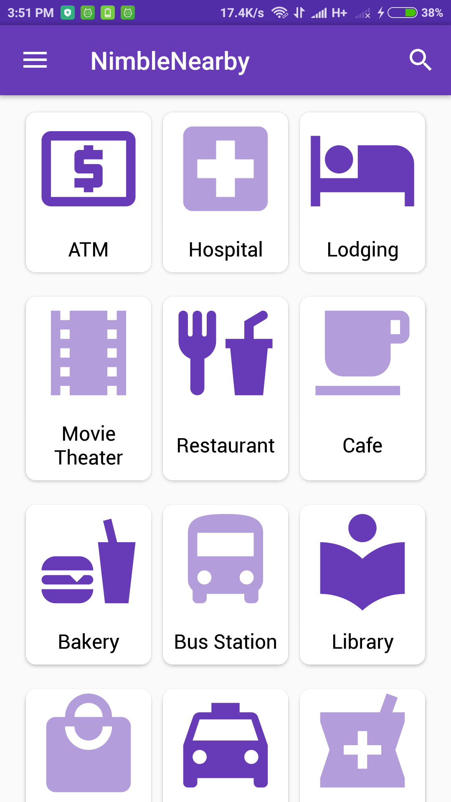
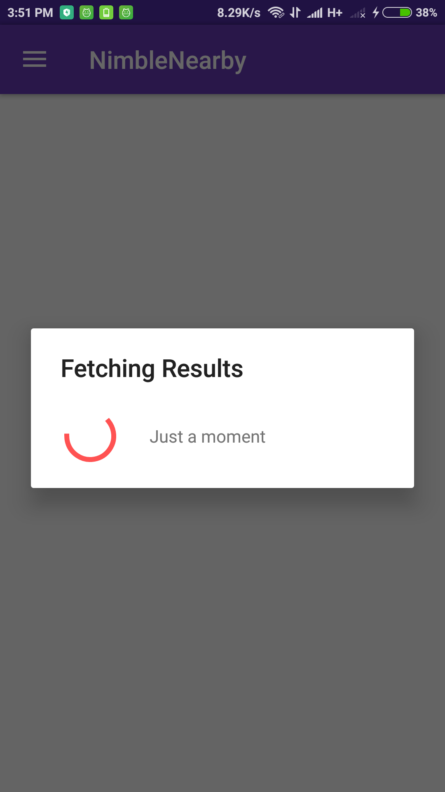
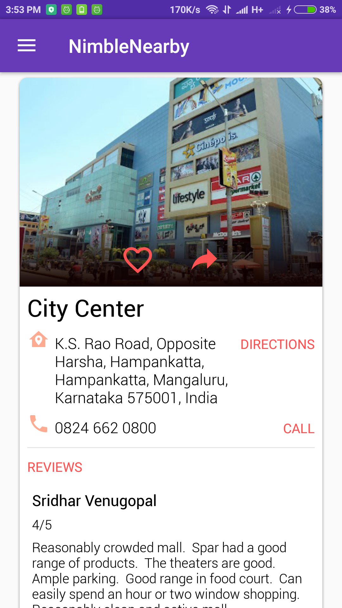
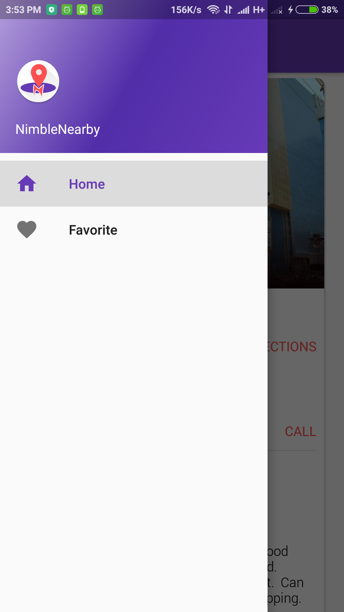
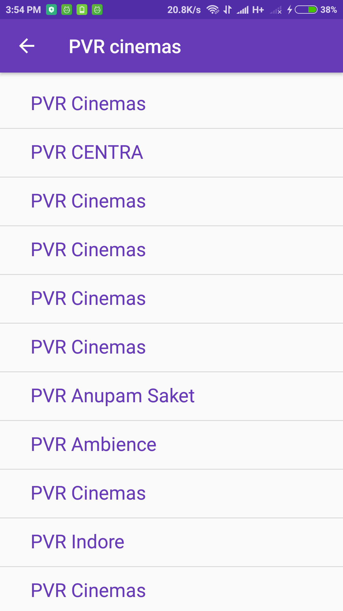

# NimbleNearby
Nimblenearby is an Android app which searches and displays point of interest's around the user using the full gamut of the Android framework, including a Material user experience and the use of a variety of Google Play services.

## Prerequisite
```
Provide the Google Services API_KEY in /app/build.gradle
```
## Screenshots

#### Main Screen


#### Fetching the Results

 
#### Point Of Interest Result Screen


#### Detailed Point Of Interest Screen


#### Navigation Drawer


#### Search Results Screen


## Libraries Used
* [EventBus](https://github.com/greenrobot/EventBus) - Android optimized event bus that simplifies communication between Activities, Fragments, Threads, Services, etc. Less code, better quality. 
* [Retrofit](https://github.com/square/retrofit) - Type-safe HTTP client for Android and Java by Square, Inc.
* [ButterKnife](https://github.com/JakeWharton/butterknife) - Bind Android views and callbacks to fields and methods. 
* [SimpleProvider](https://github.com/Triple-T/simpleprovider) - A simple way to write ContentProviders and SQL Databases for Android Apps.
* [Gson](https://github.com/google/gson) - A Java serialization/deserialization library to convert Java Objects into JSON and back
* [OKHttp](https://github.com/square/okhttp) - An HTTP+HTTP/2 client for Android and Java applications.

## Contact me:
Email : amal.aug95@gmail.com

[Primary Website](http://Amalkrishnan.me)

[Twitter](https://twitter.com/amal_krish)
